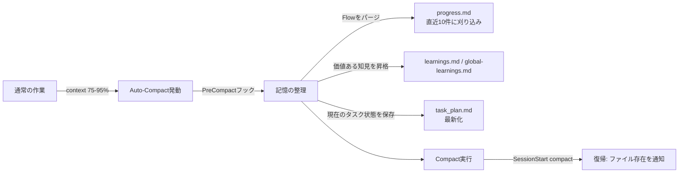
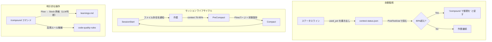
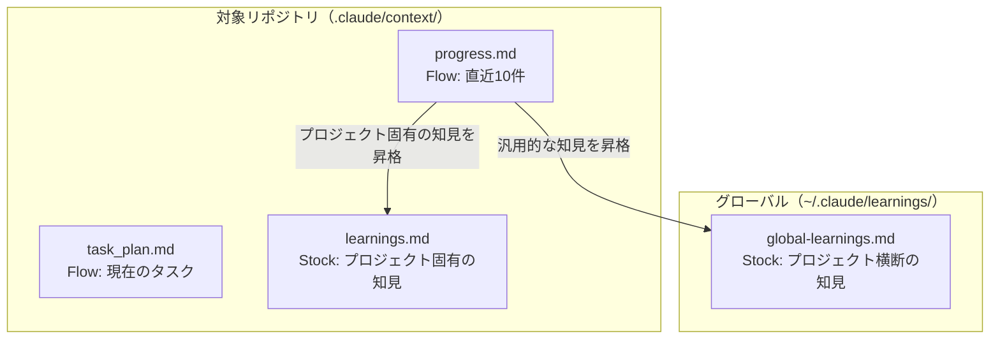

# v0.2 Feature Expansion — Learnings from Popular Claude Code Plugins

## Overview

claude-praxisの次期バージョン（v0.2）で、人気のClaude Codeプラグインから得た知見を取り入れ、4つの新機能を追加する。現在の「チーム開発ワークフロー」の強みを維持しつつ、デバッグ・永続化・知識蓄積・セキュリティの各領域を強化する。

## Goals / Non-Goals

### Goals

- 体系的デバッグスキルの追加（根本原因分析のプロセスを標準化）
- ファイルベースの永続化によるcontext消失への耐性強化
- 実装で得た知識を次タスクに複利的に活かす仕組み
- code-quality-rulesへのセキュリティ観点の追加

### Non-Goals

- claude-memのようなフルメモリシステムの構築（MCP依存が増えすぎる）
- 他プラグインのスキルをそのまま移植すること（思想を取り入れ、独自実装する）
- UIコンポーネント生成やブラウザテスト機能（スコープ外）

## Background

### 調査対象と結果

以下の人気プラグイン/スキルリポジトリを調査した。

| リポジトリ | Stars | 主な特徴 |
|-----------|-------|---------|
| obra/superpowers | 46,225 | TDD強制、体系的デバッグ、自動トリガー |
| anthropics/skills | 64,778 | Agent Skills標準、ドキュメント生成 |
| thedotmack/claude-mem | 24,329 | 永続メモリ、3層検索、トークン10x節約 |
| OthmanAdi/planning-with-files | 13,230 | 3ファイルパターン、ファイル=ディスク思想 |
| EveryInc/compound-engineering | 7,365 | 知識の複利化、80%計画/20%実装 |
| trailofbits/skills | 2,426 | セキュリティ監査、脆弱性検出 |
| blader/Claudeception | 1,553 | 自律的スキル抽出 |

### claude-praxisの現状ギャップ

現在のスキル構成（10スキル）をマッピングすると:

```
✅ カバー済み: TDD、コードレビュー、サブエージェント、Design Doc、worktrees
❌ 未カバー: デバッグ、コンテキスト永続化、知識蓄積、セキュリティルール
```

## Proposal

4つの機能を段階的に追加する。

### Feature 1: systematic-debugging スキル

**元ネタ**: obra/superpowers の `systematic-debugging`

superpowersでは4フェーズの根本原因分析プロセスを定義している:

> **Conceptual** — 最終的な実装はプロジェクトの文脈に合わせて調整する。

```
Phase 1: Reproduce — 問題を確実に再現する手順を確立
Phase 2: Isolate — 最小再現ケースに絞り込む
Phase 3: Diagnose — 仮説を立てて検証する（推測で修正しない）
Phase 4: Fix & Verify — 修正し、再現手順で確認する
```

claude-praxisでの実装方針:
- 上記4フェーズをSKILL.mdに定義
- agent-team-executionと連携し、並列で仮説検証できる構成
- verification-before-completionと統合（修正後の証拠を必須化）

**トリガー条件**: バグ報告、エラー調査、「なぜ動かない」系の質問

### Feature 2: context-persistence スキル

**元ネタ**: OthmanAdi/planning-with-files + thedotmack/claude-mem

planning-with-filesの核心的な発想:

> context window = RAM（揮発性）、ファイルシステム = ディスク（永続性）

### claude-memの教訓（実体験）

claude-memを実際に運用した結果、以下の問題が発生した:

- SessionStartフック等で自動的にコンテキストを注入する設計
- プロジェクトが育つにつれ蓄積された情報量が増大
- **今までlimitにかかったことがなかったのに、limitに到達するようになった**
- 結果的にアンインストールした

この教訓から、「自動注入」は本質的に危険であることが分かった。情報量は単調増加するため、どこかで必ずlimitに到達する。

### 設計原則: Stock（蓄積）と Flow（流れ）の分離

人間の記憶と同じモデルを採用する:

| 記憶の種類 | 性質 | 対応ファイル | 扱い |
|-----------|------|------------|------|
| **作業記憶** | 今のタスクの文脈、直近のやりとり | `progress.md` | 直近10件程度を保持、古いものは**積極的に消す** |
| **長期記憶** | 知見、パターン、品質ルール、判断理由 | `learnings.md` | 永続化、消さない。汎用的な「あるべき姿」 |
| **忘れていいもの** | 中間結果、古い進捗、完了済みタスク詳細 | なし | 保存しない。`progress.md`から定期的にパージ |

核心的な違い:

- **Flow（progress.md）**: 川のように流れる。古い情報は価値が減る。常に「直近10件」程度に刈り込む
- **Stock（learnings.md）**: 蓄積される資産。「CORSの順序依存に注意」「JWTを選んだ理由」など、プロジェクトを超えて使える知見

### 設計原則: Write Auto, Read Manual

| 操作 | 方式 | 理由 |
|------|------|------|
| 書き込み | 自動（タスク中に発見・進捗をファイルに記録） | 記録漏れを防ぐ |
| 読み込み | **手動**（必要なときだけ明示的に読む） | context windowを圧迫しない |
| パージ | **自動**（Flow情報は直近10件以外を削除） | 情報膨張を防ぐ |
| 昇格 | **判断付き**（Flowの中から長期記憶に残す価値があるものを昇格） | 知見の蓄積 |
| compact前整理 | **自動**（PreCompactフックで記憶を整理） | compact前に知見を救出 |

### PreCompactフックによる自動記憶整理

Claude Codeには `PreCompact` フックが存在する（auto-compact発火時にも動作する）。これを使い、compact直前に記憶の整理を自動実行する。



**技術的な制約と対応**:

| やりたいこと | 実現可能性 | 方法 |
|------------|-----------|------|
| compact前に記憶を整理する | **可能** | `PreCompact` フック（`auto` / `manual` マッチャー） |
| context使用量を数値で監視 | **不可**（現状） | Claude Code API未公開。feature request中 |
| compact前にFlowをパージ | **可能** | PreCompactフックでシェルスクリプト実行 |
| compact前にStock昇格を実行 | **部分的** | シェルスクリプトで機械的な整理は可能。LLM判断が必要な昇格は不可 |

**PreCompactフックの実装イメージ**:

> **Conceptual** — 最終的な実装はフック開発時に調整する。

```json
{
  "hooks": {
    "PreCompact": [
      {
        "matcher": "auto|manual",
        "hooks": [
          {
            "type": "command",
            "command": "${CLAUDE_PLUGIN_ROOT}/hooks/pre-compact.sh"
          }
        ]
      }
    ]
  }
}
```

`pre-compact.sh` が行うこと:
1. `progress.md` を直近10件に刈り込み
2. `task_plan.md` の現在時刻を記録（復帰時にどこまで進んだか分かるように）
3. 完了済みタスクの詳細を削除

**LLM判断が必要な昇格（Flow → Stock）は PreCompact では実行しない**。これは `/compound` コマンドの責務であり、compact前に機械的にやるべきではない。PreCompactフックは「Flowの刈り込み」と「状態の保存」に徹する。

### ステータスラインファイルハックによるcontext監視

Claude Codeのステータスラインスクリプトは、毎ツール使用時に `context_window.used_percentage` をJSON stdinで受け取る。これをファイルに書き出すことで、フックからcontext使用量を間接的に取得できる。

> **Conceptual** — 最終的な実装は開発時に調整する。

```bash
# ~/.claude/statusline-command.sh
input=$(cat)
used=$(echo "$input" | jq -r '.context_window.used_percentage // 0')
echo "{\"used_pct\": $used}" > ~/.claude/context-status.json
echo "Context: ${used}%"
```

**注意点**:
- `used_percentage` はシステムプロンプト・ツール定義（約40kトークン）を**含まない**。実際のcontext使用量より低く出る
- ステータスラインの更新はツール使用時のみ（会話だけでは更新されない）
- それでも「今75%超えてるか？」程度の判断には十分使える

### `/compound` の自動促進

ステータスラインファイルハックとPostToolUseフックを組み合わせると、context使用量が閾値を超えた時点で `/compound` 実行を促すことができる:

> **Conceptual** — 最終的な実装は開発時に調整する。

```bash
# PostToolUse hook
if [ -f ~/.claude/context-status.json ]; then
  ctx_pct=$(jq -r '.used_pct' ~/.claude/context-status.json)
  if [ "$ctx_pct" -gt 60 ]; then
    echo "Context ${ctx_pct}%: /compound で知見を整理してください"
  fi
fi
```

これにより `/compound` のタイミング問題が解決する:

| 方式 | タイミング | 問題 |
|------|-----------|------|
| 手動のみ | ユーザーが忘れる | 知見が失われる |
| `/implement` 完了後に固定 | 実装が短い場合は不要 | 過剰 |
| **context 80%超えで促進** | contextが育ったタイミング | compact前に余裕を持って整理できる |

### フックの全体像



SessionStartフックでは**ファイルの存在と概要だけ**を伝え、中身は注入しない:

> **Conceptual** — 最終的な文言はフック実装時に調整する。

```
永続化ファイル:
- task_plan.md (最終更新: 2h ago) — 現在のタスク計画
- progress.md (直近8件) — 最近の作業ログ
- learnings.md (12件) — プロジェクト知見
必要に応じて読み込んでください。
```

### ファイル配置: 2つのスコープ

ファイルの性質によって配置先が異なる:



| ファイル | 種類 | 配置先 | 役割 | ライフサイクル |
|---------|------|--------|------|-------------|
| `task_plan.md` | Flow | `{repo}/.claude/context/` | 現在のタスク計画とフェーズ進捗 | タスク完了で削除 |
| `progress.md` | Flow | `{repo}/.claude/context/` | 直近の作業ログ（最大10件） | 古い項目を自動パージ |
| `learnings.md` | Stock | `{repo}/.claude/context/` | **そのプロジェクト固有**の知見 | 永続。リポジトリと一緒に管理 |
| `global-learnings.md` | Stock | `~/.claude/learnings/` | **プロジェクト横断**で使える知見 | 永続。マシン上で共有 |

### 知見の2段階精査

`/compound` 実行時に、知見をどちらに振り分けるかを判断する:

| 判断基準 | 例 | 配置先 |
|---------|---|--------|
| このリポジトリでしか使わない | 「このAPIのレート制限は100req/min」「DB migrationの実行順序」 | `learnings.md`（プロジェクト固有） |
| どのプロジェクトでも使える | 「CORSの順序依存に注意」「JWTのrefresh token設計パターン」 | `global-learnings.md`（汎用） |
| コード品質の普遍ルール | 「evalは使わない」「境界でバリデーション」 | `code-quality-rules`（self-evolution） |

claude-praxisでの実装方針:
- Flow（task_plan, progress）は対象リポジトリの `.claude/context/` に配置
- Stock（learnings）はプロジェクト固有とグローバルの2階層
- SessionStartフックでは**ファイル存在の通知のみ**（中身は注入しない）
- compact/clear後、Claudeが必要に応じてファイルを読む判断をする
- `progress.md` は直近10件を超えたら古い項目をパージ（情報膨張を防止）
- `.claude/context/` は `.gitignore` に追加を推奨（タスク進捗はチームに共有不要）
- `learnings.md` はgit管理するかプロジェクトごとに判断（チーム共有したければコミット）

**トリガー条件**: 長時間タスクの開始時、明示的な永続化リクエスト時

### Feature 3: compound-learning コマンド

**元ネタ**: EveryInc/compound-engineering-plugin の `/compound` コマンド

compound-engineeringの核心:

> 各作業単位が、次の作業単位を楽にする — 難しくしない

実装タスク完了後に以下を記録する:

| 記録項目 | 内容 | 例 |
|---------|------|---|
| パターン | 再利用可能な実装パターン | 「認証ミドルウェアの追加手順」 |
| 落とし穴 | 遭遇した問題とその解決策 | 「CORSの順序依存性に注意」 |
| 判断理由 | 技術的判断の根拠 | 「JWTを選んだ理由: ステートレス要件」 |

claude-praxisでの実装方針:
- `/compound` コマンド（commands/compound.md）として実装
- `/compound` は「Flow → Stock への昇格」を明示的に実行するコマンド
- 実行時に各知見を**3つの振り分け先**に精査する:

| 振り分け先 | 判断基準 | 例 |
|-----------|---------|---|
| `{repo}/.claude/context/learnings.md` | このプロジェクトでしか使わない | 「このAPIのレート制限仕様」 |
| `~/.claude/learnings/global-learnings.md` | どのプロジェクトでも使える | 「CORSミドルウェアは認証の前に配置」 |
| `code-quality-rules` (self-evolution) | 普遍的な品質ルール | 「evalは使わない」 |

**トリガー条件**: `/implement` 完了後、`/review` 完了後

### Feature 4: security-rules（code-quality-rules拡張）

**元ネタ**: trailofbits/skills のセキュリティ監査パターン

Trail of Bitsのスキルから抽出したルール候補:

| ルール | 内容 |
|-------|------|
| No Hardcoded Secrets | `.env`、設定ファイル経由で管理。コードに直書き禁止 |
| Input Validation at Boundaries | 外部入力（API、ユーザー入力）は必ずバリデーション |
| No `eval` / Dynamic Execution | `eval()`, `Function()`, `exec()` 禁止 |
| Dependency Awareness | 新規依存追加時にセキュリティリスクを確認 |

claude-praxisでの実装方針:
- code-quality-rules/SKILL.md に新セクション「Security Rules」を追加
- 既存のself-evolution protocolで運用（チームが追加・修正可能）
- 新スキルは作らず、既存スキルの拡張として統合

**トリガー条件**: 既存のcode-quality-rulesと同じ（コード記述・レビュー時に自動適用）

## Alternative Concerns

### Decision: メモリシステムの範囲

| Option | Pros | Cons |
|--------|------|------|
| A: claude-mem統合（フルメモリ） | 高機能、セマンティック検索 | **実績: limit到達でアンインストール済み**。自動注入が根本原因 |
| B: Serena MCP活用 | 既にプロジェクトで使用中 | セッション間の永続性が弱い |
| **C: ファイルベース + 手動読み込み** | 依存ゼロ、limit安全、透明性高い | 検索はgrep頼み、復帰に一手間 |

**Why C**: claude-memの実運用で「自動注入 → 情報膨張 → limit到達」を経験済み。ファイルに書くが読むのは手動、というアプローチならcontext windowを圧迫しない。markdownファイルなのでgit管理もでき、チーム全員が内容を確認できる。
**Revisit if**: Claude Codeのcontext window上限が大幅に拡大し、自動注入のリスクが下がった場合

### Decision: デバッグスキルの独立性

| Option | Pros | Cons |
|--------|------|------|
| A: superpowersをそのまま併用 | 実績あり、メンテ不要 | 思想が異なる部分あり、依存が増える |
| **B: 独自スキルとして実装** | チームワークフローと統合、agent-team連携 | 実装コスト |

**Why B**: agent-team-executionとの並列仮説検証や、verification-before-completionとの統合はclaude-praxis固有の強み。自前で実装することで一貫したワークフローを提供できる。
**Revisit if**: superpowersがプラグイン間連携をサポートした場合

### Decision: セキュリティルールの配置

| Option | Pros | Cons |
|--------|------|------|
| A: 新スキル `security-rules/` | 独立管理、ON/OFF切り替え可能 | スキル数が増える、トリガー重複 |
| **B: code-quality-rules内に統合** | 既存のself-evolution運用に乗る、一箇所管理 | スキルが肥大化する可能性 |

**Why B**: セキュリティはコード品質の一部であり、別スキルにする理由がない。self-evolutionプロトコルで追加・修正できるため柔軟性も担保される。
**Revisit if**: セキュリティルールが20個以上に膨らんだ場合

## Implementation Plan

### Phase 1: security-rules（code-quality-rules拡張）

既存スキルへの追記のみ。最もリスクが低い。

- code-quality-rules/SKILL.md に Security Rules セクションを追加
- 4ルール（No Hardcoded Secrets / Input Validation / No eval / Dependency Awareness）

### Phase 2: systematic-debugging スキル

新スキル追加。他スキルへの影響なし。

- skills/systematic-debugging/SKILL.md の作成
- 4フェーズプロセスの定義
- agent-team-execution連携の記述
- getting-startedスキルの更新（スキル一覧に追加）

### Phase 3: context-persistence スキル

新スキル + SessionStartフック改修。

- skills/context-persistence/SKILL.md の作成
- 3ファイルパターンの定義
- hooks/session-start.sh の更新（永続化ファイル読み込み追加）
- getting-startedスキルの更新

### Phase 4: compound-learning コマンド

新コマンド + finding記録の仕組み。

- commands/compound.md の作成
- context-persistenceのfindings.mdとの連携定義
- self-evolution protocolとの統合ルール
- README.mdの更新（コマンド一覧に追加）

## Open Questions

1. **context-persistenceの3ファイルの配置場所**: `.claude/context/` vs プロジェクトルート vs `.context/`？git管理するかどうかで変わる
2. **compound-learningの記録フォーマット**: 自由記述 vs 構造化テンプレート？チームでの共有を考えると構造化が望ましいが、記録のハードルが上がる
3. **既存ユーザーへの影響**: v0.1からのアップデート時、新スキルのトリガーが既存ワークフローを邪魔しないか検証が必要

## Review Checklist

- [ ] 各スキルのトリガー条件が既存スキルと競合しないこと
- [ ] 新スキルがwriting-skillsのTDDプロセスに従って作成されること
- [ ] READMEとCLAUDE.mdの整合性
- [ ] SessionStartフック改修の後方互換性
- [ ] 実際のワークフローで一連の流れをE2Eテスト
