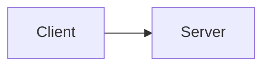

# Design Doc Format

Write documents that work in Notion and are ready for team review.

## Why Over How

A Design Doc is a **decision record**, not an implementation guide.

### The Core Principle

**Write WHY generously. Write HOW sparingly.**

- **WHY this design**: What problem it solves, what constraints shaped it, why alternatives were rejected — this stays valid even when the implementation changes
- **HOW it's implemented**: Code examples, directory structures, API details — these become lies the moment someone refactors

### What the Doc Must Answer

When a newcomer joins the team and reads the doc, they should NOT need to ask:
- "Why did we choose this approach over X?"
- "Was Y considered? Why not?"
- "What assumptions is this design based on?"
- "Under what conditions would we reconsider this?"

If they still have these questions after reading, the doc is incomplete.

### What the Doc Should NOT Contain

- Detailed code examples (the code itself is the source of truth)
- Directory structures (these change with refactoring)
- Step-by-step implementation guides (this belongs in the implementation plan, not the design)
- API response schemas (these belong in API documentation, not the design rationale)

**Exception**: When a specific implementation detail IS the design decision (e.g., "we use CQRS pattern because..."), include just enough code to illustrate the concept, marked as **Conceptual**.

## Absolute Rules

### No Local File Links

```markdown
❌ Forbidden
[See implementation](./src/auth/middleware.ts)
[Details here](../docs/architecture.md)
[Related skill](skills/code-quality-rules/SKILL.md)

✅ Correct
Describe inline — the reader doesn't have access to your local file system.
If referencing code, quote the relevant snippet directly.
If referencing another document, describe its content or link to a shared URL (Notion page, GitHub permalink).
```

**Why**: Notion does not resolve local paths. Links like `[text](./path)` become dead text.
This also applies to any document shared with the team — they can't click into your repo.

### No `####` (h4) or Deeper

```markdown
❌ Forbidden
#### Sub-sub-section
##### Even deeper

✅ Correct
### Sub-section (h3 is the maximum depth)
```

**Why**: Notion's heading hierarchy goes to h3. Deeper headings lose their formatting and become ambiguous.

### No ASCII Diagrams

```markdown
❌ Forbidden
+--------+     +--------+
| Client | --> | Server |
+--------+     +--------+

✅ Correct — use mermaid

```

**Why**: ASCII diagrams break with font changes and don't render well in Notion. Mermaid diagrams are supported and remain editable.

## Document Structure

Every Design Doc follows this structure:

```markdown
# [Feature/Change Name]

## Overview
One paragraph: what this is and why it matters.

## Goals / Non-Goals

### Goals
- What this design WILL achieve (measurable where possible)

### Non-Goals
- What this design explicitly WILL NOT address
- Prevents scope creep and sets clear boundaries for reviewers

## Background
The problem in detail. Current state, pain points, and what triggered this proposal.

## Proposal
What we're proposing and WHY this approach was chosen.
Focus on the reasoning and constraints that led to this design, not the implementation details.

### Key Design Decisions
For each significant decision in the design, explain:
- What was decided and why
- What constraints or requirements drove this choice
- What trade-offs were accepted

### High-Level Architecture (optional)
Only if the system structure IS the design decision.
Use mermaid diagrams to show relationships, not implementation details.

## Alternative Concerns
**This section is mandatory.** Its purpose is to prevent repeated discussions.

For each major decision, document:
1. What options were considered
2. Pros/cons of each
3. Why this option was chosen
4. Under what conditions we'd revisit this decision

Format:

### Decision: [What was decided]

| Option | Pros | Cons |
|--------|------|------|
| A: [option] | ... | ... |
| B: [option] | ... | ... |
| **C: [chosen]** | ... | ... |

**Why C**: [Clear reasoning for the choice]
**Revisit if**: [Conditions that would change this decision]

## Concerns
Known risks, uncertainties, ambiguities, and unresolved questions about this design.
For each concern: state what is unclear or risky, and how it will be addressed (mitigation, further investigation, or accepted as-is).

## Review Checklist
- [ ] Architecture approved
- [ ] Security implications reviewed
- [ ] Performance impact assessed
- [ ] Migration plan (if applicable)
```

### Why "Alternative Concerns" Is Mandatory

- New team members will ask "why didn't we do X?" — the answer is already in the doc
- You will forget why you chose this approach in 3 months — the doc remembers
- Reviewers may suggest an approach you already evaluated — point to the doc instead of re-investigating
- If conditions change later, "Revisit if" tells you when to reconsider

## Code Snippets — Use Sparingly

**Default: don't include code.** The Design Doc explains WHY, not HOW. Code changes; rationale doesn't.

### When Code IS Appropriate

Only include code when the code itself IS the design decision (e.g., a specific pattern, interface contract, or data structure that is central to the proposal).

### Rules for Included Code

1. **Always mark as Conceptual**: All code in Design Docs is illustrative, not final.
   > **Conceptual** — illustrates the approach, not the final implementation.
2. **Keep under 10 lines**: If you need more, summarize in prose instead.
3. **No local file links**: Notion can't resolve them. Describe inline or quote directly.

## Integration

- Used during the Design Phase (`/design` command)
- Documents are reviewed by the team before implementation begins
- Feeds into `/plan` for implementation planning
